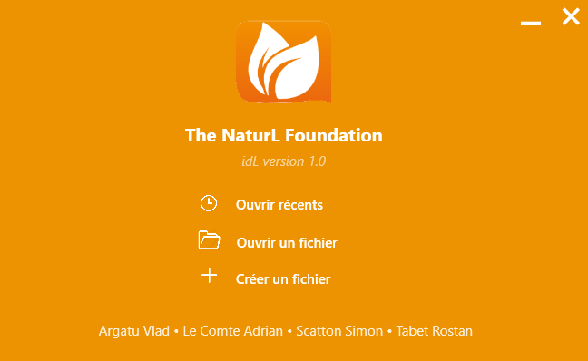
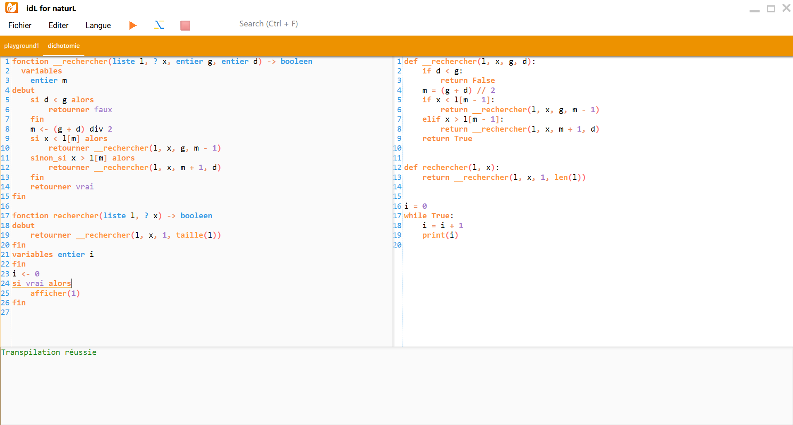

# idL

Bienvenue sur le projet idL. idL est l'IDE spécialement conçu et développé pour écrire du code en naturL. Vous pourrez trouver une documentation plus ample de idL et de naturL ainsi que l'installeur de notre projet sur notre site web : https://thenaturlfoundation.github.io/. Une vidéo de présentation de toutes les fonctionnalités détaillés de idL sera bientôt publiée pour aider a l'utilisation de cet outil.

idL est actuellement le seul IDE qui peut exécuter du code naturL et de le transpiler vers Python. Le nom du langage, "naturL", comme son nom l'indique, provient du fait qu'il est inspiré du langage naturel, aussi appelé pseudo-code. C'en est une version formalisée, permettant d'écrire du code sans ambiguïté. La documentation complète ainsi que la syntaxe du langage est disponible sur notre site web. Ainsi, idL se présente comme un outil permettant d'écrire en langage naturL, de le transpiler ainsi que de l'exécuter plus aisément.

# Le protocole de serveur linguistique (Language server protocol en anglais)
Afin de rendre idL plus puissant, nous avons implémenté le protocole LSP (protocole de serveur linguistique).
Mais que fait-il ? Pour comprendre, laissez-nous vous expliquer comment fonctionne notre projet. idL n'est ni 'instance chargée de traduire le code, ni de l'analyser. Lorsque l'utilisateur va demander à l'IDE de traduire son code en Python, ce dernier va se charger de transmettre le code écrit par l'utilisateur dans l'exécutable naturL. En fait c'est naturL qui s'occupe de toute l'analyse du code de et de sa traduction, l'IDE n'y est pour rien. Ceci étant dit, attardons nous sur le protocole LSP. Ce dernier nous a permis d'implémenter des fonctionnalités présente dans la plupart IDE avec par telles que l'autocomplétion intelligente en fonction du contexte, le possibilité de revenir a la définition d'une fonction ou d'une variable. Notons que cette autocomplétion des variables déjà présentes dans le code n'est pas proposée dans 100% des cas, cela vient de l'analyseur qui fonctionne quand le code écrit est correcte. Ce problème sera corrigé dans des versions futures. Le protocole LSP permet également un soulignage en temps réel des erreurs de l'utilisateur.

Alors comment ce protocole fonctionne-t-il ? En fait, dès que l'utilisateur va appuyer sur une touche une requête sera envoyée au serveur LSP (en fait cela se fait 0,5 secondes après que l'utilisateur ait arrêté d'écrire, c'est une sécurité pour éviter une surcharge de requêtes ce qui ferait "bugger" l'interface). Dans cette requête toutes les informations du fichier utilisé sont envoyées au serveur. Le serveur va envoyer toutes ces informations a l'analyseur qui est naturL et va lui demander de faire une analyse. Ce dernier va lui répondre avec un diagnotique du document avec toutes les erreurs présentes etc. L'interface IDL, elle va récupérer toutes ces informations et donc appliquer le traitement sur le code de l'utilisateur.

Prenons un exemple, lorsque l'utilisateur demande d'aller à la définition d'une fonction, idL envoie une requête au serveur LSP qui va lui même faire analyser le code par naturL et lui demander de déterminer où la fonction est définie. Ce dernier va lui renvoyer une position (le fichier et la ligne) où est définie la variable ou la fonction. L'éditeur va ensuite intepreter ce que le serveur lui envoie et donc le placer au niveau de la fonction et la surligner.

Attention, nous avons découvert que le protocole LSP présente quelque défauts. En attendant la correction de ces derniers nous allons publier une version dans laquelle il est possible de le désactiver.

Comme dit précedemment de plus amples explications sont présentes dans la documentation de notre site web, une vidéo de présentation arrive bientôt. Amusez-vous bien sur idL et surtout si vous rencontrez des bugs que nous n'aurions pas vu n'hesitez pas à nous les faire parvenir, nous les corrigerons.

